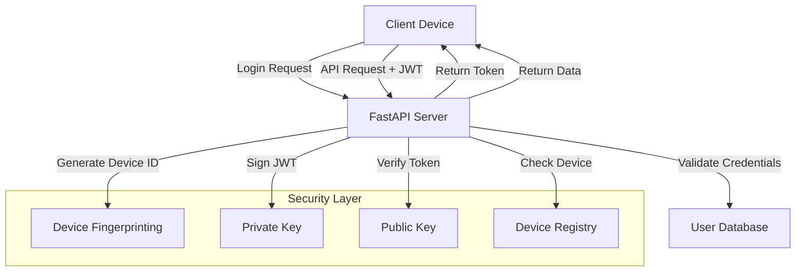

# FastAPI JWT Authentication with Device Identification


A Proof-of-Concept implementation of JWT authentication using public-private key cryptography with device identification. This solution demonstrates how to securely authenticate users while identifying the source device for enhanced security.

## Key Features

- 🔐 **Asymmetric JWT authentication** (RS256 algorithm)
- 📱 **Device fingerprinting and identification**
- 🔄 **Automatic RSA key pair generation**
- ⏱️ **Token expiration and refresh mechanism**
- 📊 **Device-specific security policies**
- 🛡️ **Secure password hashing with bcrypt**

## Technology Stack

- **Framework**: FastAPI
- **Authentication**: JWT with RS256
- **Cryptography**: Python-JOSE, Passlib
- **Server**: Uvicorn
- **Key Management**: OpenSSL-generated RSA keys

## System Architecture



## API Endpoints

### 1. Login - Obtain JWT Token

**Endpoint:** `POST /login`

**Request:**
```bash
curl -X POST "http://localhost:8000/login" \
  -H "Content-Type: application/x-www-form-urlencoded" \
  -d "username=johndoe&password=secret"
```

**Response:**
```json
{
  "access_token": "eyJhbGciOiJSUzI1NiIs...",
  "token_type": "bearer",
  "device_id": "a1b2c3d4e5"
}
```

---

### 2. User Profile - Protected Endpoint

**Endpoint:** `GET /profile`

**Request:**
```bash
curl "http://localhost:8000/profile" \
  -H "Authorization: Bearer <ACCESS_TOKEN>"
```

**Response:**
```json
{
  "username": "johndoe",
  "device": {
    "id": "a1b2c3d4e5",
    "type": "mobile",
    "user_agent": "Mozilla/5.0 (iPhone; CPU iPhone OS 15_0 like Mac OS X)"
  },
  "message": "Authenticated from mobile device"
}
```

---

### 3. Sensitive Action - Device Verification Example

**Endpoint:** `GET /sensitive-action`

**Request:**
```bash
curl "http://localhost:8000/sensitive-action" \
  -H "Authorization: Bearer <ACCESS_TOKEN>" \
  -H "Confirmation: yes"
```

**Response (example):**
```json
{
  "status": "Action performed with mobile device verification"
}
```